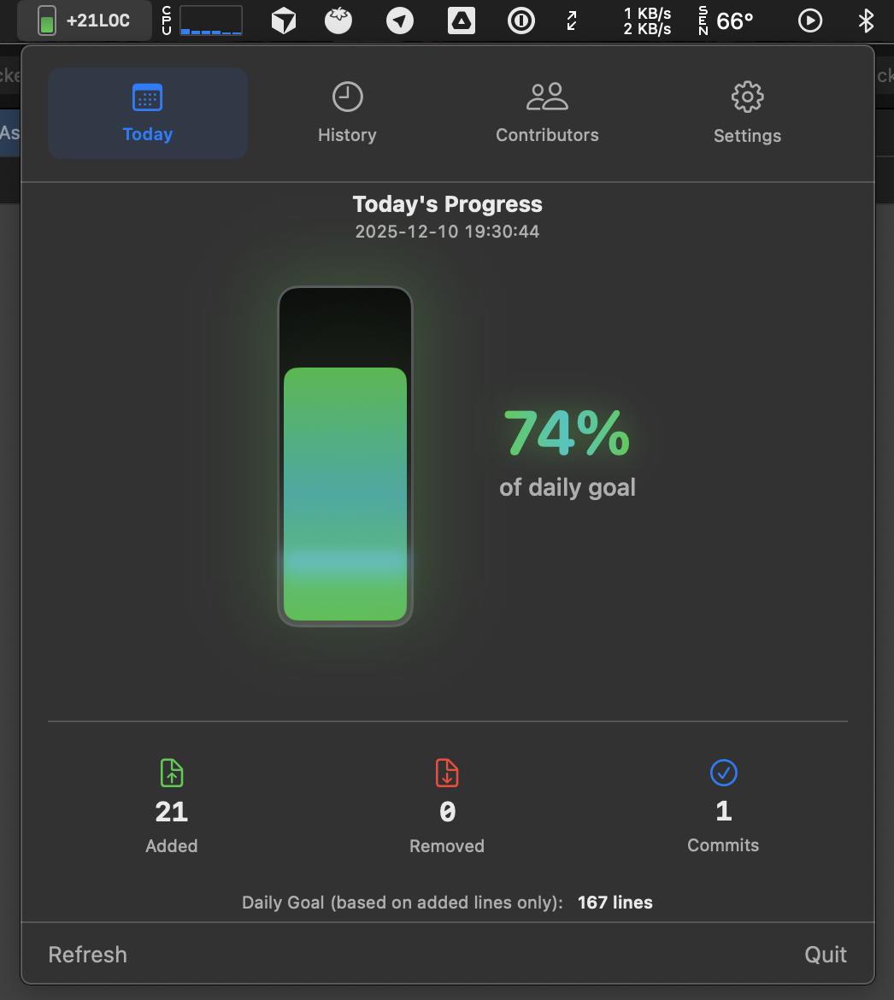
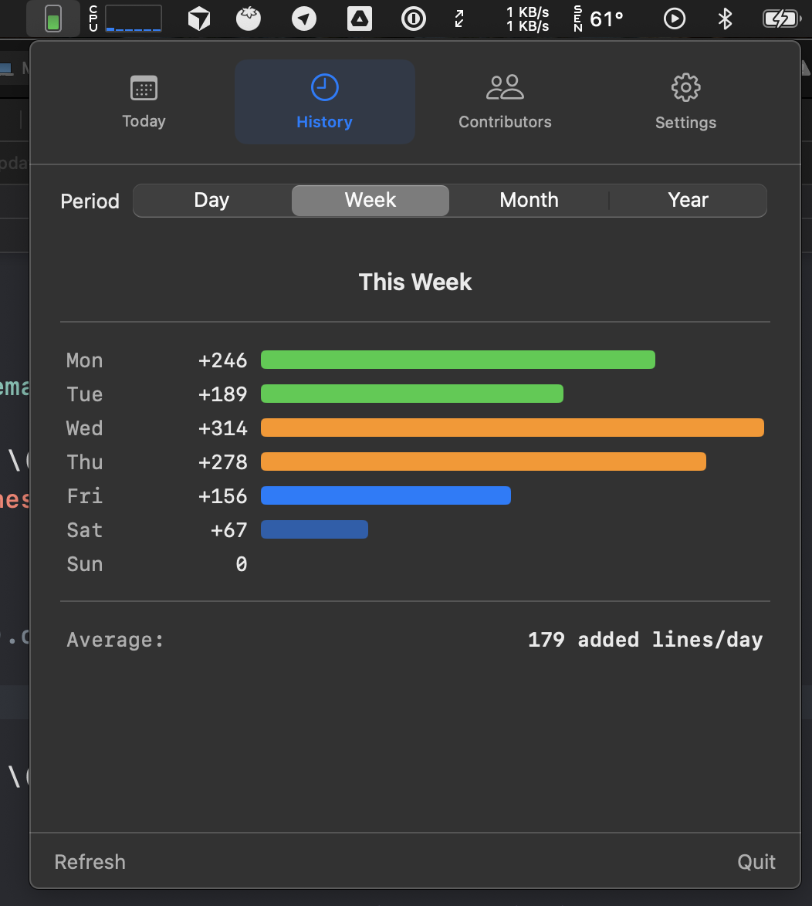
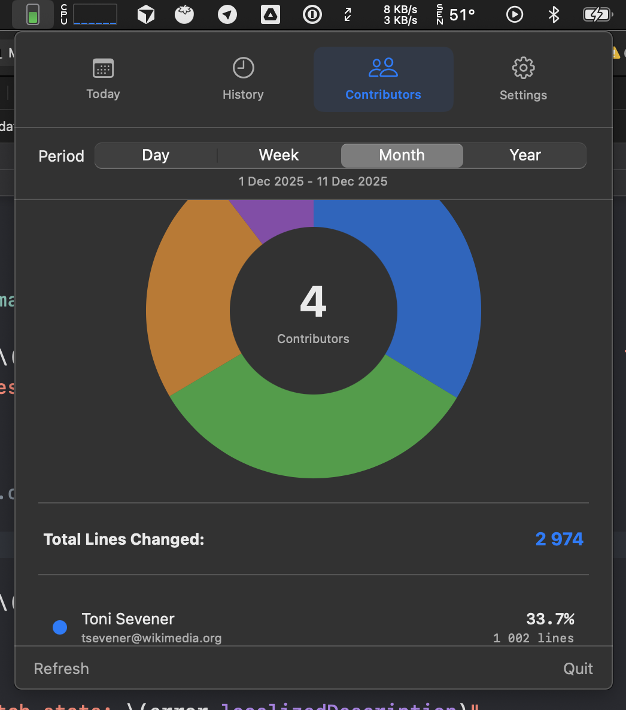

#  Developer Performance Tracker

**A motivational menu bar app for macOS developers**

Track your daily coding productivity through git commits. Menu bar app for macOS that keeps you motivated and helps you grow alongside your team.

[Features](#features) • [Screenshots](#screenshots) • [Setup](#setup) • [Privacy](#privacy) • [Download](#download)

## Features

🎯 Set Daily Goals  
📊 Track Progress  
📅 History - Day, Week, Month, Year  
👥 Team Comparison  
🔒 100% Offline

## Why I Built This
I wanted a simple way to stay motivated and be more productive every day. Just a quiet progress bar in my menu bar that reminds me to keep shipping code.
I've been using this app myself for months, and it's helped me build better coding habits. Now I'm sharing it with you. Hope it helps you too! 🚀

## Screenshots

### Daily Progress

  

### History

  

### Team Comparison

  

## Privacy

**Zero Data Collection Policy**

Developer Performance Tracker operates entirely offline:
- ✅ No network requests
- ✅ No analytics/tracking
- ✅ No third-party SDKs
- ✅ All settings stored locally (`UserDefaults`)

### Setup
  
1. Add your repo path – Point to any git repository on your Mac
2. Set your daily target – See what your teammates commit and choose your goal
3. Find yourself – Select your git user from the contributors list
4. That's it! – Start coding and watch your progress grow

## Feedback & Contact

Found a bug? Have a feature idea? I'd love to hear from you!

- 🐛 **GitHub Issues** – [Open an issue](https://github.com/lebad/DeveloperPerformanceTracker/issues) for bugs or feature requests
- 💼 **LinkedIn** – [Connect with me](https://www.linkedin.com/in/andrey-lebedev-30a9a4101/)
- 💬 **In-App** – Use the feedback button inside the app

All feedback is welcome – it helps make the app better for everyone!

## Download

📥 **[Download for macOS](https://github.com/lebad/DeveloperPerformanceTracker/releases/latest)**

---

## Support the Developer

If this app helps you, consider buying me a coffee:

